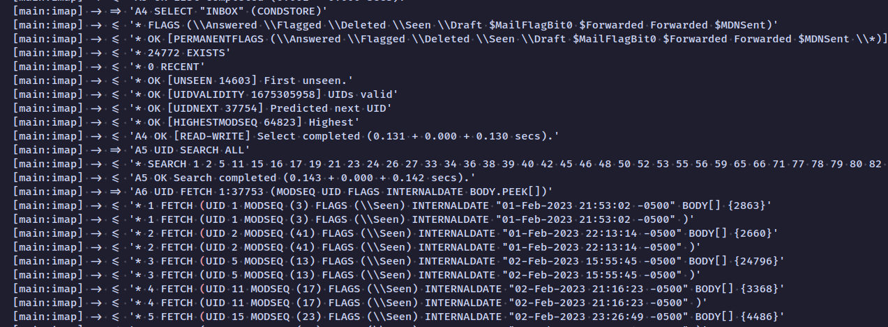

# 📧 Email Script!



## ⚠️ Work in Progress

This is a **Linux executable** script (tested on Linux only).  
You can also just clone the repo, install dependencies, and run it directly with Node.js.

> **Note:** If you’re using Gmail, you **must** use [App Passwords](https://support.google.com/accounts/answer/185833?hl=en).  
> This has not been tested extensively with Gmail.

---

## 🚀 Features

- Fetches all **unread emails** via IMAP.
- Parses messages with [`mailparser`](https://nodemailer.com/extras/mailparser/).
- **Automatic management rules**:
  - 📆 Emails older than **6 months** → marked as read.
  - 📦 Emails older than **1 year** → archived (unless flagged).
  - 🛠 Emails sent to `jobs@saahild.com` → moved to `INBOX.jobs`.
  - 🎓 Emails sent to `edu@saahild.com` → moved to `INBOX.Edu`.
  - 🐙 Emails **from `@github.com`** or sent **to `git@saahild.com`** → moved to `INBOX.git`.
- Optionally take **today’s emails** and generate an AI summary for quick review.

---

## 📂 Project Structure

```

.
├── index.js          # Main script
├── package.json
├── .env              # Your IMAP credentials (not checked into git)
├── .env.example      # Example environment config
└── screenshot.png    # Banner for this project

```

---

## ⚙️ Setup

### 1. Clone the repo

```bash
git clone https://github.com/NeonGamerBot-QK/email-script.git
cd email-script
```

### 2. Install dependencies

```bash
pnpm install
# or npm install
```

### 3. Configure environment variables

Create a `.env` file in the project root (see `.env.example` for reference):

```ini
IMAP_HOST=imap.yourmail.com
IMAP_PORT=993
IMAP_USER=you@example.com
IMAP_PASS=yourpassword
```

> For **Gmail users**, use an **App Password** (not your normal password).

### 4. Run the script

```bash
node index.js
```

Or use the **Linux executable** build (if provided):

```bash
./email-script
```

---

## 📜 Example Workflow

1. Script connects to your IMAP inbox.
2. Collects unread emails.
3. Applies date-based rules (mark as read / archive).
4. Sorts into subfolders like **Jobs**, **Edu**, or **GitHub**.
5. (Optional) Saves today’s emails for an **AI-generated summary**.

---

## 🛠 Customization

Add new rules in `index.js`. For example:

```js
if (emailsTsWasSentTo.includes("finance@saahild.com")) {
  imap.move(email.seq, "INBOX.Finance", (err) => { ... });
}
```

---

## ⚡️ Roadmap

- [ ] Add Gmail-specific config presets.
- [ ] Support multiple accounts at once.
- [ ] CLI flags for dry-run, debug, and rule toggles.
- [ ] AI summaries of daily emails.

---

## 📖 License

MIT © 2025 Saahil Dutta
